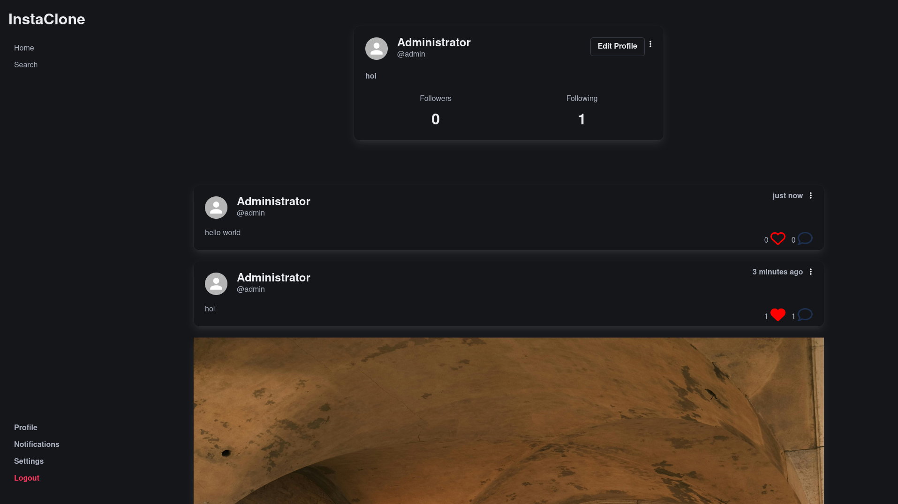

# Insta-Clone

Welcome to Insta-Clone, a simplified clone of the popular social media platform Instagram. This project is developed for educational purposes to understand the basic functionalities of Instagram, such as user authentication, photo uploading, and feed display.

## Features

- User Authentication
  - Sign up
  - Log in
  - Log out
- Profile Management
  - Update profile information
  - View user profiles
- Photo Uploading
  - Upload photos
  - Display photos in user feeds
- Feed
  - View latest photos from all users
- Like and Comment
  - Like photos
  - Comment on photos

## Technologies Used

- Backend: PHP
- Frontend: HTML, CSS(Bulma), JavaScript
- Database: MySQL

## Progress

We are not planning to work on this repo anymore!